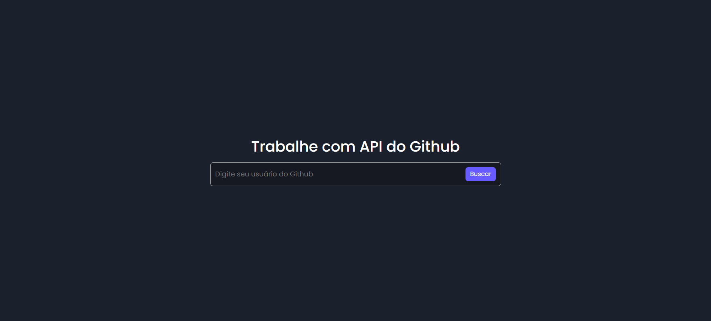

<div align="center">

Veja o projeto <a href="https://apiusergithub.netlify.app/"> Busca de usuários do Github</a>

<p>Este projeto consiste em uma interface web que permite buscar informações de usuários do Github utilizando a API do Github. É construído com HTML, CSS e JavaScript puro.</p>
</div>



👨🏼‍💻 <b>Tecnologias Utilizadas:</b>

&nbsp;
&nbsp;
&nbsp;<hr>

🛠️ <b>Explicação do projeto:</b>

Este projeto fornece uma interface simples para buscar e exibir informações de usuários do Github. Utiliza HTML para a estrutura, CSS para o estilo e JavaScript para interagir com a API do Github e manipular o DOM.<br><br>

⚙️ <b>Executando o projeto:</b>

<p>Antes de começar, certifique-se de atender aos seguintes requisitos:</p>

[Git](https://git-scm.com/downloads "Download Git") deve ser instalado em seu sistema operacional.

Para executar o <b>projeto</b> localmente, execute este comando em seu git bash:

<b>Linux e macOS:</b>

```bash
git clone https://github.com/daniel-portela/github-api-interface.git
```

<b>Windows:</b>

```bash
git clone https://github.com/daniel-portela/github-api-interface.git
```
Depois de clonar o repositório, acesse o projeto com o seguinte comando:

```bash
cd github-api-interface
```

```bash
Você pode abri-lo no VS Code digitando "code ."
```

<br>👨🏼‍💻 <b>Usando o projeto:</b>

- Abra o index.html no navegador

- Você pode abrir o arquivo index.html diretamente no seu navegador.

- Digite o Nome de Usuário do Github

- No campo de entrada, digite o nome de usuário do Github que você deseja buscar.

- Clique no botão "Buscar" para obter as informações do usuário. Os resultados serão exibidos abaixo do campo de busca.<br><br>

🛠️ <b>Customização</b>

- Estilo: Para alterar o estilo do formulário, edite o arquivo assets/css/styles.css.

- Layout: Para modificar a estrutura do formulário, edite o arquivo index.html.

- Funcionalidade: Para adicionar novas funcionalidades, edite o arquivo assets/js/scripts.js.<br><br>

⚙️ <b>Manutenção do código:</b>

Compromisso com a melhoria contínua do projeto, incluindo atualizações regulares de conteúdo e refinamento do design conforme necessário.<br><br>

✉️ <b>Contato:</b>

Se você tiver alguma dúvida, sugestão ou interesse em colaborar, não hesite em me contatar.

Email: <a href="mailto:danielportela.ti@gmail.com">danielportela.ti@gmail.com</a> 

